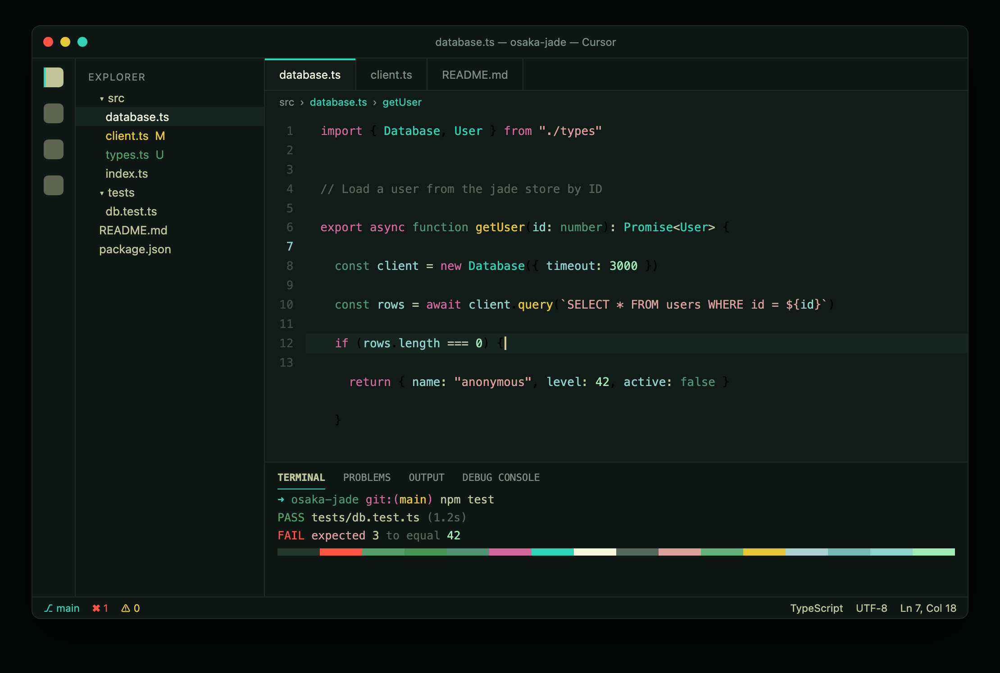
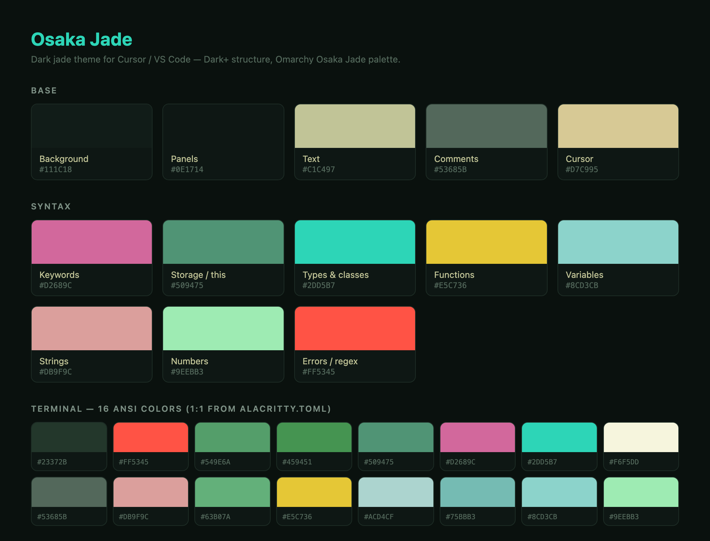

# Osaka Jade — a theme for Cursor / VS Code

A dark **jade** color theme. It takes the structure and highlighting logic of the
default VS Code **Dark+** theme and recolors it with the
[Omarchy "Osaka Jade"](https://github.com/Justikun/omarchy-osaka-jade-theme)
palette. The goal: the familiar Dark+ feel for reading code, in a deep jade-green
atmosphere.



## Palette



| Role | Color | |
|---|---|---|
| Editor background | `#111c18` | dark jade |
| Text | `#C1C497` | cream |
| Comments | `#53685B` | muted sage |
| Keywords | `#D2689C` | pink |
| `const` / storage / `this` | `#509475` | teal |
| Types & classes | `#2DD5B7` | jade ⭐ |
| Functions | `#E5C736` | gold |
| Variables / properties | `#8CD3CB` | soft jade |
| Strings | `#db9f9c` | rose |
| Numbers | `#9eebb3` | mint |
| Cursor | `#D7C995` | gold |

The 16 terminal ANSI colors are taken 1:1 from the original `alacritty.toml`, so
the integrated terminal matches the Linux version of the theme.

## Installation

### From the `.vsix` package

```bash
# 1) build the package (requires Node.js)
npx @vscode/vsce package
#    → produces osaka-jade-0.1.0.vsix

# 2) install into Cursor
cursor --install-extension osaka-jade-0.1.0.vsix
```

If the `cursor` command isn't on your `PATH`, use the bundled binary directly
(macOS):

```bash
"/Applications/Cursor.app/Contents/Resources/app/bin/cursor" \
  --install-extension osaka-jade-0.1.0.vsix
```

Or via the UI: `Extensions` → "…" (top-right menu) → **Install from VSIX…**

### Activation

`Cmd/Ctrl+Shift+P` → **Preferences: Color Theme** → **Osaka Jade**.

### Quick development without packaging

Copy the folder into your user extensions and restart Cursor:

```bash
cp -r . ~/.cursor/extensions/osaka-jade-0.1.0
```

## Customizing

Everything lives in a single file: `themes/osaka-jade-color-theme.json`
(`colors` = UI, `tokenColors` = syntax, `semanticTokenColors` = semantics).
After editing, switch the theme off and back on in Cursor, or run
`Developer: Reload Window`.

The browser previews used to generate the screenshots above live in `preview/`.

## Attribution

The color palette is based on the **Osaka Jade** theme by
[Justikun](https://github.com/Justikun/omarchy-osaka-jade-theme) (MIT).
This is a standalone port for Cursor / VS Code, also licensed under MIT.
